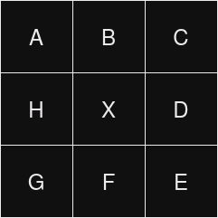
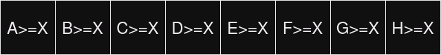

# Local Binary Patterns
This repository implements in Julia the <a href="https://en.wikipedia.org/wiki/Local_binary_patterns">local binary pattern descriptor</a>.

- Input: image of *N* x *N* pixels.
- Ouput: image of *N* x *N* pixels with an unmodified border of 1 pixel (for simplicity reasons).
- Algorithm: for each pixel in the image calculate a value depending on his 8-adjacent values. 

Matrix used to calculate the value for pixel X  |  Result for pixel X as a binary value 
:-------------------------:|:-------------------------:
  |  


# Dependencies
To execute the program you need to install the following modules:
 - FileIO
 - ImageView
 - ColorTypes
 - Images
 - Colors
 - FixedPointNumbers

That can be achieved from the Julia interpreter. Executing the following commands:
```
    using Pkg
    Pkg.add("ColorTypes");Pkg.add("Images");Pkg.add("Colors")
    Pkg.add("FileIO");Pkg.add("ImageView");Pkg.add("FixedPointNumbers")
```

# Execution
*lenna.png* can be replaced with a valid image path. 

```
    julia lbp.jl ./imgs/lenna.png
```
## Execution example 
lenna.png             |  output.png
:-------------------------:|:-------------------------:
  |  

